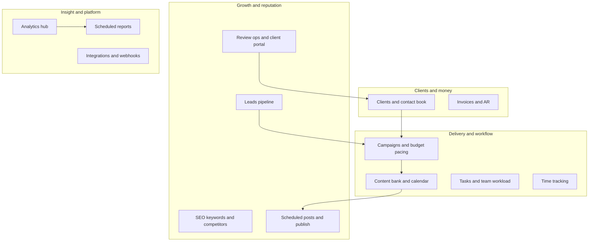

# Skynexia DM — Digital Marketing Dashboard

An internal agency dashboard for managing clients, campaigns, reviews, leads, content, and team operations. Built with Next.js 16 (App Router), MongoDB, TypeScript, Tailwind CSS, and shadcn/ui.

---

## Table of contents

- [Features](#features)
- [Tech stack](#tech-stack)
- [Getting started](#getting-started)
- [Environment variables](#environment-variables)
- [Project structure](#project-structure)
- [Review workflow](#review-workflow-core-feature)
- [API overview](#api-overview)
- [Authentication](#authentication)
- [Social publishing](#social-publishing)
- [Email](#email)
- [Cron jobs](#cron-jobs)
- [Deployment](#deployment)
- [Capability map](#capability-map)

---

## Features

### Client management
- Full CRM: create, edit, archive clients with contact info, contracts, monthly budget, industry, location, and marketing channels
- Review destination URLs and QR codes per platform (Google, Facebook, Justdial, etc.)
- Manager assignment and client status tracking (Active / Inactive / Archived)

### Review draft workflow (core feature)
A structured pipeline for collecting and tracking customer reviews:
- **Drafts** — a bank of AI-written or manually created review templates per client
- **Allocations** — assign drafts to team members with customer contact info and target platform
- **Lifecycle** — track each review: `Assigned → Shared with Customer → Posted → Used`
- **Posted reviews** — proof records with review link, proof URL, and platform
- Activity logs with full audit trail per draft and allocation
- Bulk operations: assign clients, assign users, set platform (single API call)
- CSV import and export of draft banks
- WhatsApp deep-links to send review destination URLs and review text to customers
- Contact autocomplete from past allocations for the same client
- Platform dropdown pre-filtered to the client's configured review destinations
- Recycling: reset Used/Archived drafts back to Available

### Campaigns and paid media
- Campaign planning with platforms, budgets, date ranges, and status tracking
- Spend entry tracking with budget pacing calculations
- Budget alerts at configurable spend thresholds
- Google Ads inbound webhook integration

### Lead pipeline
- Lead capture and stage tracking: New → Contacted → Qualified → Won / Lost
- Lead scoring, estimated value, and campaign attribution
- Activity history per lead
- Inbound leads via Facebook Leads, Typeform, and generic webhooks

### Tasks
- Task management with priority (Low / Medium / High / Critical) and status (Todo / In Progress / Blocked / Done)
- Assignment to team members, deadline tracking, bulk operations

### Content bank
- Store captions, hashtags, ad copy, CTAs, hooks per client
- Status: Draft / Approved / Archived; source: Manual / AI / Import
- Tag-based organisation and platform targeting

### Scheduled posts
- Schedule social media posts for future publishing
- Supports Facebook, Instagram, LinkedIn, Twitter/X
- Auto-publish via cron every 15 minutes or manually via **Publish Now**
- Status tracking: Scheduled / Published / Failed / Cancelled

### SEO
- Keyword tracking with rank history, search volume, and difficulty
- Competitor tracking with keyword rank comparisons

### Team management
- Role-based permissions: Admin, Manager, Content Writer, Designer, Analyst
- 23 granular permissions across reviews, tasks, campaigns, leads, content, SEO, and settings
- Team assignments, workload tracking, performance metrics, and activity logs

### Invoicing
- Invoice generation with line items, tax, and currency
- Item master for reusable line items
- Statuses: Draft / Sent / Paid / Overdue / Cancelled
- Recurring invoice support

### Analytics and reporting
- Multi-view dashboard: Overview, Operations, Content & Reviews, Growth, Technical (admin)
- Review delivery funnel widget: Assigned → Shared → Posted with week-over-week delta
- Scheduled PDF reports with configurable frequency (Weekly / Monthly / Quarterly)
- Client portal for tokenised report and approval access

### Integrations
- Inbound webhooks: Facebook Leads, Google Ads, Typeform, Generic
- Field mapping system and event logging
- API key authentication per integration

---

## Tech stack

| Layer | Technology |
|-------|-----------|
| Framework | Next.js 16.1.5 (App Router, React 19) |
| Language | TypeScript 5.9.2 |
| Styling | Tailwind CSS 3.4 + shadcn/ui + Radix UI |
| Database | MongoDB via Mongoose 8.9.2 |
| Auth | Custom HMAC-SHA256 sessions (bcryptjs passwords) |
| Email | Resend / SMTP / console (pluggable) |
| Social | Facebook Graph API, Instagram Graph API, LinkedIn, twitter-api-v2 |
| Validation | Zod 4 |
| Build | Turborepo + pnpm |
| Deployment | Vercel (with Vercel Cron) |

---

## Getting started

### Prerequisites

- Node.js 18+
- pnpm 9+
- MongoDB (local or cloud)

### Installation

```bash
# From the repo root
pnpm install

# Or just install the dm app
cd apps/dm && pnpm install
```

### Environment variables

Copy `.env.example` to `.env.local`:

```bash
cp apps/dm/.env.example apps/dm/.env.local
```

Minimum required variables:

```env
MONGODB_URI=mongodb://localhost:27017/skynexia
AUTH_SECRET=replace-with-a-long-random-secret-min-32-characters
NEXT_PUBLIC_API_URL=http://localhost:3152
```

See [Environment variables](#environment-variables) below for the full reference.

### Seed an admin user

```bash
cd apps/dm
pnpm seed:user
```

### Run in development

```bash
# From repo root
pnpm dev --filter=dm

# Or from apps/dm
pnpm dev
```

Open [http://localhost:3152](http://localhost:3152).

---

## Environment variables

All variables are server-side unless prefixed `NEXT_PUBLIC_`.

### Required

| Variable | Description |
|----------|-------------|
| `MONGODB_URI` | MongoDB connection string |
| `AUTH_SECRET` | Secret for HMAC session signing (min 32 chars in production) |
| `NEXT_PUBLIC_API_URL` | Public base URL of the app (e.g. `http://localhost:3152`) |

### Optional — AI content generation

| Variable | Description |
|----------|-------------|
| `ANTHROPIC_API_KEY` | Anthropic API key (used first if set) |
| `OPENAI_API_KEY` | OpenAI API key (fallback) |

### Optional — Email

| Variable | Description |
|----------|-------------|
| `EMAIL_PROVIDER` | `resend`, `smtp`, or unset (console logging) |
| `RESEND_API_KEY` | Resend API key (when `EMAIL_PROVIDER=resend`) |
| `EMAIL_FROM` | Sender address |
| `SMTP_HOST` | SMTP host (when `EMAIL_PROVIDER=smtp`) |
| `SMTP_PORT` | SMTP port |
| `SMTP_USER` | SMTP username |
| `SMTP_PASS` | SMTP password |

### Optional — Social publishing

| Platform | Variables |
|----------|-----------|
| Facebook | `FACEBOOK_ACCESS_TOKEN`, `FACEBOOK_PAGE_ID` |
| Instagram | `FACEBOOK_ACCESS_TOKEN`, `INSTAGRAM_BUSINESS_ACCOUNT_ID` |
| LinkedIn | `LINKEDIN_ACCESS_TOKEN` |
| Twitter/X | `TWITTER_API_KEY`, `TWITTER_API_SECRET`, `TWITTER_ACCESS_TOKEN`, `TWITTER_ACCESS_TOKEN_SECRET` |

### Optional — Cron

| Variable | Description |
|----------|-------------|
| `CRON_SECRET` | Bearer token for cron route authentication |

### Optional — Integrations

| Variable | Description |
|----------|-------------|
| `GOOGLE_PLACES_API_KEY` | Enables Google Reviews import |

---

## Project structure

```
apps/dm/
├── app/
│   ├── api/                    # 130+ REST API routes
│   │   ├── auth/               # Login / logout
│   │   ├── clients/            # Client CRUD
│   │   ├── review-drafts/      # Draft CRUD, assign, duplicate, export, recycle
│   │   ├── review-allocations/ # Allocation lifecycle, mark-shared, mark-posted, bulk-patch
│   │   ├── review-activity/    # Activity log fetch
│   │   ├── campaigns/          # Campaign management
│   │   ├── leads/              # Lead pipeline
│   │   ├── tasks/              # Task management
│   │   ├── content-bank/       # Content items
│   │   ├── scheduled-posts/    # Post scheduling and publishing
│   │   ├── team/               # Members, roles, assignments, performance
│   │   ├── invoices/           # Invoicing
│   │   ├── keywords/           # SEO keyword tracking
│   │   ├── competitors/        # Competitor tracking
│   │   ├── integrations/       # Webhook integrations
│   │   ├── dashboard/          # Aggregated dashboard stats
│   │   ├── cron/               # Scheduled tasks (posts, reports, budget pacing)
│   │   ├── portal/             # Client portal (approvals, comments, reports)
│   │   └── admin/              # Admin: users, audit log, webhooks
│   ├── dashboard/              # All authenticated pages
│   │   ├── review-drafts/      # Draft management page
│   │   ├── review-allocations/ # Allocation tracking page
│   │   ├── clients/
│   │   ├── campaigns/
│   │   ├── leads/
│   │   ├── tasks/
│   │   ├── content/
│   │   ├── scheduled-posts/
│   │   ├── team/
│   │   ├── invoices/
│   │   ├── analytics/
│   │   └── admin/
│   ├── login/
│   └── portal/                 # Client-facing portal
├── components/
│   ├── ui/                     # shadcn/ui primitives
│   ├── dashboard/              # Dashboard views and widgets
│   └── reviews/                # Review workflow components
├── lib/
│   ├── auth.ts                 # Session creation and verification
│   ├── mongodb.ts              # Mongoose connection pooling
│   ├── review-activity.ts      # Activity logging helper
│   ├── reviews/                # Unassigned client helper
│   ├── team/                   # Permissions, current user helpers
│   ├── dashboard/              # Page data aggregation
│   └── api/                    # Validation, error helpers, schemas
├── models/                     # 43 Mongoose models
├── types/                      # TypeScript interfaces
└── vercel.json                 # Cron schedule configuration
```

---

## Review workflow (core feature)

```
ReviewDraft  (template review text per client)
     │
     │  assign to team member
     ▼
ReviewAllocation  (status: Assigned)
     │
     │  team member contacts customer, shares review link
     ▼
ReviewAllocation  (status: Shared with Customer)
     │
     │  customer posts the review
     ▼
PostedReview  (proof record: link, screenshot, platform, date)
ReviewAllocation  (status: Posted / Used)
     │
     │  automatically bridged
     ▼
Review  (legacy review model — keeps dashboards in sync)
```

**Activity logging** captures every state transition with old/new values and performer.

---

## API overview

### Review drafts

| Method | Path | Description |
|--------|------|-------------|
| `GET` | `/api/review-drafts` | List with filters |
| `POST` | `/api/review-drafts` | Create draft |
| `GET` | `/api/review-drafts/export` | Export as CSV |
| `POST` | `/api/review-drafts/import` | Bulk import from CSV |
| `GET/PATCH/DELETE` | `/api/review-drafts/[id]` | Get / update / archive |
| `POST` | `/api/review-drafts/[id]/assign` | Assign to team member |
| `POST` | `/api/review-drafts/[id]/duplicate` | Duplicate draft |
| `PATCH` | `/api/review-drafts/[id]/recycle` | Reset Used/Archived → Available |
| `PATCH` | `/api/review-drafts/[id]/assign-client` | Reassign to a client |
| `PATCH` | `/api/review-drafts/assign-client` | Bulk reassign clients |

### Review allocations

| Method | Path | Description |
|--------|------|-------------|
| `GET/POST` | `/api/review-allocations` | List / create; `?groupByContact=true&clientId=` for contact autocomplete |
| `GET/PATCH` | `/api/review-allocations/[id]` | Get / update |
| `PATCH` | `/api/review-allocations/[id]/mark-shared` | Mark as shared with customer |
| `PATCH` | `/api/review-allocations/[id]/mark-posted` | Mark as posted (creates PostedReview + bridges to Review) |
| `PATCH` | `/api/review-allocations/[id]/mark-used` | Mark as used |
| `PATCH` | `/api/review-allocations/bulk-patch` | Bulk set platform in one DB call |

### Activity

| Method | Path | Description |
|--------|------|-------------|
| `GET` | `/api/review-activity` | Fetch activity log (`?entityType=DRAFT&entityId=`) |

### Clients

| Method | Path | Description |
|--------|------|-------------|
| `GET/POST` | `/api/clients` | List / create |
| `GET/PUT/DELETE` | `/api/clients/[id]` | Get / update / archive |
| `GET` | `/api/clients/[id]/stats` | Client-level statistics |

### Other key routes

- `GET/POST /api/campaigns` — campaign management
- `GET/POST /api/leads` — lead pipeline
- `GET/POST /api/tasks` — task management
- `GET/POST /api/content-bank` — content items
- `GET/POST /api/scheduled-posts` — scheduled posts
- `POST /api/scheduled-posts/publish` — publish now
- `GET /api/social/status` — which social platforms are configured
- `GET /api/dashboard/stats` — aggregated dashboard metrics including review funnel
- `GET /api/cron/scheduled-posts` — cron: publish due posts
- `GET /api/cron/check-budget-pacing` — cron: budget alerts
- `GET /api/cron/send-reports` — cron: email reports
- `POST /api/ai/generate-content` — AI content generation

---

## Authentication

Session-based, custom implementation:

- **Token format**: `base64url(payload).base64url(HMAC-SHA256 signature)`
- **Cookie**: `dm_session` — httpOnly, sameSite: lax, secure in production
- **Expiry**: 14 days (configurable via `SESSION_MAX_AGE_SECONDS`)
- **Edge proxy** (`proxy.ts`) validates the cookie before requests reach API routes
- API routes additionally call `requireSessionApi()` + `requireUserFromRequest()` to reload the user and check `isActive`
- Admin-only actions call `assertAdmin(user)`

**Unprotected paths** (no session required):

| Path | Reason |
|------|--------|
| `/api/auth/login`, `/api/auth/logout` | Session establishment |
| `/api/cron/*` | `Authorization: Bearer <CRON_SECRET>` |
| `/api/integrations/[id]/ingest` | `x-api-key` validated per integration |
| `/api/portal/*` | Portal token validated in handler |

---

## Social publishing

Configure platform env vars to enable outbound publishing from scheduled posts.

| Platform | Notes |
|----------|-------|
| Facebook | Graph API — `FACEBOOK_ACCESS_TOKEN` + `FACEBOOK_PAGE_ID` |
| Instagram | Graph API — requires `INSTAGRAM_BUSINESS_ACCOUNT_ID`; first line of post content must be a public image URL |
| LinkedIn | REST API — `LINKEDIN_ACCESS_TOKEN` |
| Twitter/X | `twitter-api-v2` OAuth 1.0a — all four Twitter vars required; partially implemented |

Check configured platforms at `GET /api/social/status`. The dashboard Settings page and scheduled posts banner surface this status.

---

## Email

Set `EMAIL_PROVIDER` in `.env.local`:

| Value | Behaviour |
|-------|-----------|
| `resend` | Sends via Resend API (`RESEND_API_KEY` required) |
| `smtp` | Sends via nodemailer SMTP |
| unset / `none` | Logs to server console (default, safe for development) |

---

## Cron jobs

Configured in [`vercel.json`](vercel.json) for Vercel Cron. All routes require `Authorization: Bearer <CRON_SECRET>`.

| Route | Schedule | Purpose |
|-------|----------|---------|
| `/api/cron/scheduled-posts` | Every 15 min | Publish due scheduled posts |
| `/api/cron/check-budget-pacing` | Every 15 min | Trigger budget alerts |
| `/api/cron/send-reports` | Configurable | Email scheduled reports |
| `/api/cron/sync-post-metrics` | Configurable | Sync post engagement metrics |

---

## Deployment

```bash
# Production build
pnpm build --filter=dm

# Start (from apps/dm)
pnpm start
```

Ensure all required env vars are set in your Vercel project settings. MongoDB Atlas is recommended for production.

---

## Capability map

This map compares common agency operations needs with what Skynexia DM supports.



| Capability | Coverage |
|------------|---------|
| Client / account management | Full CRM, contract dates, budgets, manager assignment, contact book |
| Campaigns and paid media | Campaign planning, spend tracking, budget pacing, budget alerts, Google Ads webhook |
| Content operations | Content bank, scheduled posts, cron publishing, review draft workflow |
| SEO | Keyword tracking, rank history, competitors, competitor keyword ranks |
| Lead generation | Pipeline, activity history, Facebook Leads / Typeform / webhook ingestion |
| Reviews and reputation | Drafts, allocations, requests, templates, posted reviews, client portal, analytics |
| Social analytics | Analytics hub, post metrics, channel metrics |
| Work management | Tasks, team assignments, workload, performance, activity logs, role-based permissions |
| Time and billing | Time entries, invoices, item master, accounts receivable |
| Reporting and client comms | Scheduled reports, PDF export, SMTP / Resend email, client portal |
| Integrations and automation | Inbound webhooks, field mapping, event logging, API key auth |
| Security / admin | HMAC sessions, 23-permission RBAC, admin users, audit log, webhook admin |

### Gaps vs broad agency suites

- Email marketing / newsletter campaigns (segments, journeys)
- Proposal-to-contract-to-e-sign workflow
- Full ad platform UI (creative management, bulk campaign editing)
- Enterprise DAM depth (asset rights, versioning, governance)
- Profitability forecasting tied to retainers / projects
- Twitter/X publishing (OAuth 1.0a partially implemented)
- Automated test suite

---

## Deep operations scan (folders, files, components, fields, workflows)

This is an implementation scan of what exists now in `apps/dm`.

### Repository scan

#### Top-level folders and purpose

| Folder | Purpose |
|--------|---------|
| `app/` | Next.js App Router pages, layouts, and API route handlers |
| `components/` | Reusable UI and feature components |
| `hooks/` | Custom hooks for features and UI state |
| `lib/` | Shared business logic/utilities (auth, permissions, helpers) |
| `models/` | Mongoose schemas/data models |
| `types/` | Shared TypeScript types and permissions |
| `scripts/` | Utility scripts (e.g. seed flows) |
| `public/` | Static assets |

#### App route groups and representative files

| Group | Example files | Use |
|------|----------------|-----|
| Dashboard | [`app/dashboard/page.tsx`](app/dashboard/page.tsx), [`app/dashboard/analytics/page.tsx`](app/dashboard/analytics/page.tsx), [`app/dashboard/reviews/page.tsx`](app/dashboard/reviews/page.tsx) | Main operations workspace |
| Clients | [`app/clients/page.tsx`](app/clients/page.tsx), [`app/clients/new/page.tsx`](app/clients/new/page.tsx), [`app/clients/[clientId]/page.tsx`](app/clients/[clientId]/page.tsx) | Client management and account views |
| Team | [`app/team/page.tsx`](app/team/page.tsx), [`app/team/members/page.tsx`](app/team/members/page.tsx), [`app/team/roles/page.tsx`](app/team/roles/page.tsx) | Team, roles, assignments, activity |
| Core domains | [`app/campaigns/[...slug]/page.tsx`](app/campaigns/[...slug]/page.tsx), [`app/content/[...slug]/page.tsx`](app/content/[...slug]/page.tsx), [`app/seo/[...slug]/page.tsx`](app/seo/[...slug]/page.tsx), [`app/leads/[...slug]/page.tsx`](app/leads/[...slug]/page.tsx) | Marketing delivery domains |
| Finance/reporting | [`app/invoices/[...slug]/page.tsx`](app/invoices/[...slug]/page.tsx), [`app/reports/[...slug]/page.tsx`](app/reports/[...slug]/page.tsx), [`app/time-tracking/[...slug]/page.tsx`](app/time-tracking/[...slug]/page.tsx) | Billing, reporting, utilization |
| Portal | [`app/portal/[token]/page.tsx`](app/portal/[token]/page.tsx), [`app/portal/[token]/campaigns/page.tsx`](app/portal/[token]/campaigns/page.tsx), [`app/portal/[token]/reviews/page.tsx`](app/portal/[token]/reviews/page.tsx) | Token-based external collaboration |
| Admin/help/settings | [`app/admin/[...slug]/page.tsx`](app/admin/[...slug]/page.tsx), [`app/help/documentation/page.tsx`](app/help/documentation/page.tsx), [`app/settings/page.tsx`](app/settings/page.tsx) | Governance, docs, app settings |

#### API domains (`app/api`)

- Core entities: `users`, `clients`, `team`, `leads`, `tasks`, `templates`, `contact-book`, `search`
- Marketing/content: `campaigns`, `content-bank`, `scheduled-posts`, `social`, `social-analytics`, `channel-metrics`
- Reviews/reputation: `reviews`, `review-drafts`, `review-allocations`, `review-requests`, `review-analytics`, `review-usage`, `google-reviews`, `posted-reviews`, `portal`
- Finance/reporting: `invoices`, `report-schedules`, `dashboard`, `export`, `time-entries`
- Platform/automation: `integrations`, `webhooks`, `notifications`, `cron`, `settings`, `saved-filters`, `budget-alerts`, `item-master`

### Component scan and usage

#### Dashboard and navigation

| File | Primary use | Used by |
|------|-------------|---------|
| [`components/dashboard-layout.tsx`](components/dashboard-layout.tsx) | Shared dashboard shell | Most dashboard pages |
| [`components/dashboard/dashboard-shell.tsx`](components/dashboard/dashboard-shell.tsx) | View orchestration by mode/query | [`app/dashboard/page.tsx`](app/dashboard/page.tsx) |
| [`components/dashboard/views/overview-view.tsx`](components/dashboard/views/overview-view.tsx) | KPI overview view | Dashboard shell |
| [`components/dashboard/views/content-reviews-view.tsx`](components/dashboard/views/content-reviews-view.tsx) | Content/reviews operational view | Dashboard shell |
| [`components/dashboard/views/growth-view.tsx`](components/dashboard/views/growth-view.tsx) | Growth and pipeline view | Dashboard shell |
| [`components/dashboard-nav-links.tsx`](components/dashboard-nav-links.tsx), [`lib/dashboard-navigation.tsx`](lib/dashboard-navigation.tsx) | Permissioned nav and route tree | Sidebar/mobile nav |

#### Reviews components

| File | Primary use | Used by |
|------|-------------|---------|
| [`components/reviews/review-draft-table.tsx`](components/reviews/review-draft-table.tsx) | Draft list/filter/bulk actions and allocations | [`app/dashboard/review-drafts/page.tsx`](app/dashboard/review-drafts/page.tsx) |
| [`components/reviews/review-allocation-table.tsx`](components/reviews/review-allocation-table.tsx) | Allocation operations and status transitions | [`app/dashboard/review-allocations/page.tsx`](app/dashboard/review-allocations/page.tsx), [`app/dashboard/my-assigned-reviews/page.tsx`](app/dashboard/my-assigned-reviews/page.tsx) |
| [`components/reviews/used-reviews-table.tsx`](components/reviews/used-reviews-table.tsx) | Posted/used review records + history | [`app/dashboard/used-reviews/page.tsx`](app/dashboard/used-reviews/page.tsx) |
| [`components/reviews/review-draft-form.tsx`](components/reviews/review-draft-form.tsx) | Draft create/edit fields | Review draft create/edit pages |
| [`components/reviews/mark-shared-modal.tsx`](components/reviews/mark-shared-modal.tsx), [`components/reviews/mark-posted-modal.tsx`](components/reviews/mark-posted-modal.tsx) | Shared/posted transitions | Allocation workflows |

#### Team components

| File | Primary use | Used by |
|------|-------------|---------|
| [`components/team/TeamMemberForm.tsx`](components/team/TeamMemberForm.tsx) | Team member create/edit + login setup | Team member new/edit pages |
| [`components/team/TeamRoleForm.tsx`](components/team/TeamRoleForm.tsx) | Role and permission management | Team role new/edit pages |
| [`components/team/TeamAssignmentForm.tsx`](components/team/TeamAssignmentForm.tsx) | Cross-module assignment | Team assignment new/edit pages |
| [`components/team/TeamActivityFeed.tsx`](components/team/TeamActivityFeed.tsx) | Filtered team activity timeline | [`app/team/activity/page.tsx`](app/team/activity/page.tsx) |

#### Content components

| File | Primary use | Used by |
|------|-------------|---------|
| [`components/content/content-page-client.tsx`](components/content/content-page-client.tsx) | Content page state + saved filters | [`app/dashboard/content/page.tsx`](app/dashboard/content/page.tsx) |
| [`components/content-form.tsx`](components/content-form.tsx) | Content item authoring form | [`app/dashboard/content/new/page.tsx`](app/dashboard/content/new/page.tsx) |
| [`components/content/ai-generate-button.tsx`](components/content/ai-generate-button.tsx) | AI generation assist for content text | Content form |

### Fields available in pages and their use

#### Client pages and APIs

- Backing model: [`models/Client.ts`](models/Client.ts)
- Main fields used in create/edit/list/profile:
  - identity/contact: `name`, `businessName`, `brandName`, `contactName`, `phone`, `email`
  - profile: `status`, `website`, `industry`, `location`, `marketingChannels`
  - commercial: `contractStart`, `contractEnd`, `monthlyBudget`, `assignedManagerId`
  - review destination: `reviewDestinationUrl`, `reviewQrImageUrl`, `reviewDestinations[]`

#### Campaign pages and APIs

- Backing model: [`models/Campaign.ts`](models/Campaign.ts)
- Main fields used in campaign list/detail/analytics:
  - setup: `campaignName`, `clientId`, `platform`, `status`, `startDate`, `endDate`, `budget`, `objective`, `notes`
  - performance: `metrics.impressions`, `metrics.clicks`, `metrics.ctr`, `metrics.leads`, `metrics.conversions`, `metrics.costPerLead`, `metrics.conversionRate`

#### Lead pages and APIs

- Backing model: [`models/Lead.ts`](models/Lead.ts)
- Main fields used in lead creation, list, kanban, assignment:
  - `name`, `email`, `phone`, `source`, `status`, `clientId`, `campaignId`
  - scoring/projection: `score`, `estimatedValue`, `nextFollowUpAt`, `lostReason`
  - ownership: `assignedTo`

#### Task pages and APIs

- Backing model: [`models/Task.ts`](models/Task.ts)
- Main fields used in task management:
  - `title`, `description`, `status`, `priority`, `deadline`, `clientId`
  - assignment: `assignedTo`, `assignedToUserId`, `assignedToName`

#### Review pages and APIs

- Backing model: [`models/Review.ts`](models/Review.ts)
- Main fields used in review lifecycle:
  - content/meta: `shortLabel`, `reviewText`, `category`, `language`, `ratingStyle`, `platform`, `source`
  - status lifecycle: `status` (`UNUSED`, `USED`, `ARCHIVED`), `usedCount`
  - ownership: `clientId`

#### Time, invoices, integrations, analytics fields

- [`models/TimeEntry.ts`](models/TimeEntry.ts): `userId`, `clientId`, `taskId`, `date`, `durationMinutes`, `isBillable`, `hourlyRate`, `description`
- [`models/Invoice.ts`](models/Invoice.ts): `invoiceNumber`, `clientId`, `status`, `issueDate`, `dueDate`, `lineItems[]`, `subtotal`, `tax`, `total`, `currency`, `sentAt`, `paidAt`
- [`models/Integration.ts`](models/Integration.ts): `type`, `apiKey`, `fieldMappings[]`, `isActive`, `lastReceivedAt`
- [`models/IntegrationEvent.ts`](models/IntegrationEvent.ts): `integrationId`, `status`, `payload`, `resultEntityId`, `errorMessage`
- [`models/PostMetrics.ts`](models/PostMetrics.ts): `impressions`, `likes`, `comments`, `shares`, `clicks`, `engagementRate`, `reach`, `videoViews`
- [`models/ChannelMetrics.ts`](models/ChannelMetrics.ts): `platform`, `channelId`, `channelName`, `subscriberCount`, `fetchedAt`

### Workflows available now

#### 1) Lead capture/ingest -> pipeline progression

1. Lead enters manually from dashboard lead forms or via integration ingest.
2. Lead is triaged in list/kanban views by status/source/campaign.
3. Activity and assignment changes are tracked in lead/team flows.

#### 2) Campaign setup -> spend tracking -> pacing alerts

1. Campaign is created and linked to a client.
2. Spend/performance entries are collected over time.
3. Pacing checks trigger budget alerts and appear in pacing dashboards.

#### 3) Content authoring -> scheduling -> social publish

1. Content is drafted in content forms (optional AI assist).
2. Scheduled post records are created with platform/timing.
3. Posts are published manually or by cron to configured providers.

#### 4) Review draft -> allocation -> shared/posted -> analytics

1. Drafts are created/imported and organized in review draft workflows.
2. Drafts are allocated to users/clients.
3. Allocation status transitions (`assigned -> shared -> posted`) are recorded.
4. Posted/used outcomes feed review analytics and usage views.

#### 5) Team management -> assignments -> work execution/time

1. Team members and roles are configured with permissions.
2. Assignments/tasks are distributed through team/task modules.
3. Work execution appears in task states and logged time entries.

#### 6) Invoice lifecycle -> receivables tracking

1. Invoice with line items is created for a client.
2. Status transitions through draft/sent/paid (and overdue as applicable).
3. Accounts receivable pages track collection state.

#### 7) Scheduled reports -> dispatch

1. Report schedule is configured.
2. Cron/report routes execute send operations.
3. Delivery logs/notifications provide operational visibility.

#### 8) Portal token collaboration

1. Tokenized portal access is generated.
2. Client views campaigns/reviews in portal pages.
3. Client comments/approvals are returned into internal flows.

### Deep gap mapping

| Gap area | Existing modules | Remaining work |
|----------|------------------|----------------|
| Email marketing automation | Reporting email + notification infrastructure | Audience segmentation, campaign builder, journeys, ESP sync UI |
| Proposal/contract lifecycle | Client and invoice foundations | Proposal authoring, approvals, e-sign, contract states |
| Full paid-media operations UI | Campaigns, spend, pacing, integrations | End-to-end ad account/creative/adset management console |
| Enterprise DAM | File/content entities | Asset rights, version governance, approval workflows |
| Profitability forecasting | Time entries and invoicing | Margin/retainer forecasting and scenario models |
