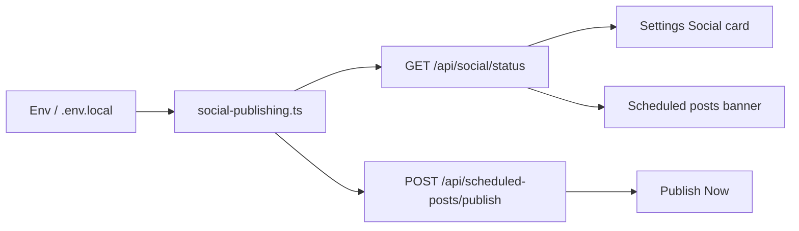

# Skynexia Digital Marketing Review Management Dashboard

A comprehensive internal client-specific digital marketing review management dashboard built with Next.js, TypeScript, Tailwind CSS, shadcn/ui, and MongoDB.

## Features

### Client Management
- Create, edit, and manage client accounts
- Client status tracking (Active, Inactive, Archived)
- Comprehensive client information storage

### Review Management
- AI-generated review storage and management
- Bulk import functionality for multiple reviews
- Review status tracking (Unused, Used, Archived)
- Categorization and language support

### Usage Tracking
- Mark reviews as used with detailed metadata
- Track usage by platform, team member, and profile
- Comprehensive usage history and analytics

### Dashboard Analytics
- Real-time statistics and metrics
- Client-wise and system-wide analytics
- Recent activity monitoring

## Tech Stack

- **Frontend**: Next.js 16 (App Router), TypeScript, Tailwind CSS
- **UI Components**: shadcn/ui with Radix UI primitives
- **Database**: MongoDB with Mongoose ODM
- **Icons**: Lucide React
- **Build Tool**: Turborepo

## Project Structure

```
apps/dm/
├── app/                    # Next.js App Router pages
│   ├── api/               # API routes
│   ├── clients/           # Client management pages
│   ├── dashboard/         # Main dashboard
│   └── layout.tsx         # Root layout
├── components/            # Reusable UI components
│   ├── ui/               # shadcn/ui components
│   └── ...               # Custom components
├── lib/                  # Utility libraries
├── models/               # Mongoose models
├── types/                # TypeScript type definitions
└── ...
```

## Getting Started

### Prerequisites
- Node.js 18+
- MongoDB (local or cloud instance)
- npm or yarn

### Installation

1. Install dependencies:
```bash
cd apps/dm
npm install
```

2. Set up environment variables:
Create `.env.local` with:
```env
MONGODB_URI=mongodb://localhost:27017/skynexia-dm
NEXT_PUBLIC_API_URL=http://localhost:3152
AUTH_SECRET=change-me-to-a-random-long-secret
```

3. Start MongoDB service

4. Run the development server:
```bash
npm run dev
```

5. Open [http://localhost:3152](http://localhost:3152) in your browser

## Social media publishing (environment variables)

Optional variables enable outbound publishing from the dashboard. They are read only on the server in [`lib/social-publishing.ts`](lib/social-publishing.ts).

### Flow



### Variables

| Platform | Variables |
|----------|-----------|
| Facebook | `FACEBOOK_ACCESS_TOKEN`, `FACEBOOK_PAGE_ID` |
| Instagram | `FACEBOOK_ACCESS_TOKEN`, `INSTAGRAM_BUSINESS_ACCOUNT_ID` (post **content**: line 1 = public image URL, following lines = caption) |
| LinkedIn | `LINKEDIN_ACCESS_TOKEN` |
| Twitter / X | `TWITTER_API_KEY`, `TWITTER_API_SECRET`, `TWITTER_ACCESS_TOKEN`, `TWITTER_ACCESS_TOKEN_SECRET` |

### Where this appears in the app

| Area | Route | Role |
|------|-------|------|
| Settings | `/dashboard/settings` | **Social Media** card shows configured vs not via `/api/social/status`. |
| Scheduled posts | `/dashboard/scheduled-posts` | Banner warns if platforms are missing; **Publish Now** calls `/api/scheduled-posts/publish`. |
| New / edit post | `/dashboard/scheduled-posts/new`, `/dashboard/scheduled-posts/[postId]/edit` | **Platform** field (free text; matched lowercase: `facebook`, `instagram`, `linkedin`, `twitter`, `x`). |

**Automated publishing**: set `CRON_SECRET` and deploy with [`vercel.json`](vercel.json) (or call `GET /api/cron/scheduled-posts` on a schedule with header `Authorization: Bearer <CRON_SECRET>`). Vercel Cron invokes this route every 15 minutes when configured. You can still use **Publish Now** manually.

Dashboard stats and review “mark posted” flows do **not** call the social publishing layer.

### Implementation notes

- **Facebook** and **LinkedIn**: Graph / REST HTTP calls when configured.
- **Instagram**: Graph API `media` + `media_publish` when token and `INSTAGRAM_BUSINESS_ACCOUNT_ID` are set (image URL required on first line of post content).
- **Twitter/X**: tweets via `twitter-api-v2` using OAuth 1.0a user tokens (all four Twitter env vars required).

### API authentication

[`proxy.ts`](proxy.ts) runs on the Edge and enforces a valid `dm_session` cookie for all `/api/*` routes except `/api/auth/login`, `/api/auth/logout`, and `/api/cron/*`. Invalid or missing sessions receive `401` JSON for API calls. Page routes outside `/portal/*` redirect to `/login` when unauthenticated. Individual route handlers may still call `requireSessionApi` / `requireUserFromRequest` for extra checks (for example admin-only actions).

### Email (`EMAIL_PROVIDER`)

- **resend**: `RESEND_API_KEY`, `EMAIL_FROM` (optional)
- **smtp**: `SMTP_HOST`, `SMTP_PORT`, `SMTP_USER`, `SMTP_PASS`, `SMTP_FROM` (uses [nodemailer](https://nodemailer.com/))
- **none** (default): logs to the server console

## API Endpoints

### Clients
- `GET /api/clients` - List all clients
- `POST /api/clients` - Create new client
- `GET /api/clients/[id]` - Get client details
- `PUT /api/clients/[id]` - Update client
- `DELETE /api/clients/[id]` - Archive client

### Reviews
- `GET /api/reviews` - List reviews (with filters)
- `POST /api/reviews` - Create review
- `POST /api/reviews/bulk` - Bulk import reviews
- `GET /api/reviews/[id]` - Get review details
- `PATCH /api/reviews/[id]` - Update review
- `DELETE /api/reviews/[id]` - Archive review
- `POST /api/reviews/mark-used` - Mark review as used

### Analytics
- `GET /api/dashboard/stats` - Dashboard statistics
- `GET /api/review-usage` - Usage history

### Social / scheduled posts
- `GET /api/social/status` - Which social platforms have required env vars set
- `POST /api/scheduled-posts/publish` - Publish a scheduled post now (`{ postId }`); uses `lib/social-publishing.ts`
- `GET /api/cron/scheduled-posts` - Publish due `SCHEDULED` posts (requires `Authorization: Bearer CRON_SECRET`)

## Database Schema

### Client
```javascript
{
  name: String,
  businessName: String,
  brandName: String,
  contactName: String,
  phone: String,
  email: String,
  notes: String,
  status: 'ACTIVE' | 'INACTIVE' | 'ARCHIVED',
  createdAt: Date,
  updatedAt: Date
}
```

### Review
```javascript
{
  clientId: ObjectId,
  shortLabel: String,
  reviewText: String,
  category: String,
  language: String,
  ratingStyle: String,
  status: 'UNUSED' | 'USED' | 'ARCHIVED',
  createdAt: Date,
  updatedAt: Date
}
```

### ReviewUsage
```javascript
{
  clientId: ObjectId,
  reviewId: ObjectId,
  sourceName: String,
  usedBy: String,
  profileName: String,
  usedAt: Date,
  notes: String,
  createdAt: Date
}
```

## Key Features Implemented

✅ Client-first architecture
✅ MongoDB with Mongoose models
✅ Responsive admin dashboard
✅ Bulk review import
✅ Review usage tracking
✅ Status management
✅ Search and filtering
✅ Professional UI with shadcn/ui
✅ TypeScript throughout
✅ API routes with proper error handling

## Usage Workflow

1. **Create Client**: Admin creates a new client account
2. **Add Reviews**: Upload AI-generated reviews for the client
3. **Track Usage**: Mark reviews as used when deployed by marketing team
4. **Monitor Analytics**: View usage statistics and client performance

## Development

### Adding New Components
Components are located in `components/` directory. Use shadcn/ui for consistent styling.

### API Development
API routes follow Next.js App Router conventions in `app/api/`.

### Database Changes
Update Mongoose models in `models/` and corresponding types in `types/`.

## Deployment

Build for production:
```bash
npm run build
npm start
```

Ensure MongoDB connection string is properly configured for production environment.
