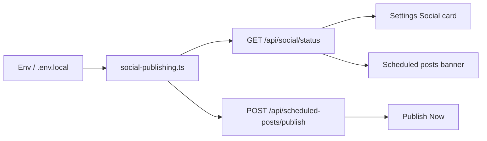
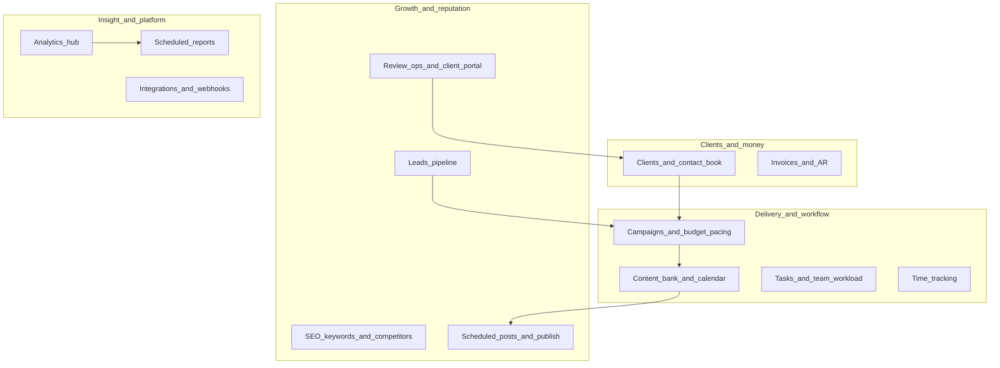

# Skynexia DM — Digital Marketing Dashboard

An internal agency operations dashboard for managing clients, campaigns, reviews, leads, content, and team operations. Built with Next.js 16 (App Router), MongoDB, TypeScript, Tailwind CSS, and shadcn/ui.

---

## Table of contents

1. [Project structure / folder tree](#1-project-structure--folder-tree)
2. [Module list / feature map](#2-module-list--feature-map)
3. [Routing structure](#3-routing-structure)
4. [Database models / schema](#4-database-models--schema)
5. [Authentication and roles](#5-authentication-and-roles)
6. [Workflow explanations](#6-workflow-explanations)
7. [API documentation](#7-api-documentation)
8. [Environment variables](#8-environment-variables)
9. [State management / frontend logic](#9-state-management--frontend-logic)
10. [Getting started](#10-getting-started)
11. [Cron jobs](#11-cron-jobs)
12. [Pending features / known gaps](#12-pending-features--known-gaps)

---

## 1. Project structure / folder tree

```
apps/dm/
├── app/                          # Next.js App Router
│   ├── layout.tsx                # Root layout (fonts, theme script, toaster)
│   ├── login/                    # Login page (public)
│   ├── portal/                   # Client portal (token-protected, public)
│   ├── clients/                  # Client list and detail pages
│   ├── dashboard/                # Main protected workspace
│   │   ├── page.tsx              # Dashboard home
│   │   ├── layout.tsx            # Dashboard layout wrapper
│   │   ├── analytics/
│   │   ├── campaigns/
│   │   ├── channel-subscribes/
│   │   ├── channels/
│   │   ├── contact-book/
│   │   ├── content/
│   │   ├── google-reviews/
│   │   ├── help/
│   │   ├── integrations/
│   │   ├── invoices/
│   │   ├── leads/
│   │   ├── my-assigned-reviews/  # Team member personal queue
│   │   ├── notifications/
│   │   ├── post-likes/
│   │   ├── post-shares/
│   │   ├── posts/
│   │   ├── reports/
│   │   ├── review-allocations/   # Allocation tracking and transitions
│   │   ├── review-analytics/
│   │   ├── review-drafts/        # Draft management and bulk ops
│   │   ├── review-requests/
│   │   ├── review-templates/
│   │   ├── reviews/
│   │   ├── scheduled-posts/
│   │   ├── seo/
│   │   ├── settings/
│   │   ├── social-analytics/
│   │   ├── tasks/
│   │   ├── time-tracking/
│   │   ├── used-reviews/
│   │   ├── budget-pacing/
│   │   └── admin/                # Admin-only pages
│   └── api/                      # 130+ REST API route handlers
│       ├── ai/
│       ├── auth/                 # login, logout
│       ├── budget-alerts/
│       ├── campaigns/
│       ├── channel-metrics/
│       ├── client-views/
│       ├── clients/
│       ├── competitors/
│       ├── connect-wall/
│       ├── contact-book/
│       ├── content-bank/
│       ├── cron/                 # Scheduled task handlers
│       ├── dashboard/
│       ├── email/
│       ├── export/
│       ├── files/
│       ├── google-reviews/
│       ├── integrations/
│       ├── invoices/
│       ├── item-master/
│       ├── keywords/
│       ├── leads/
│       ├── notifications/
│       ├── portal/               # Public, token-authenticated
│       ├── posted-reviews/
│       ├── report-schedules/
│       ├── review-activity/
│       ├── review-allocations/
│       ├── review-analytics/
│       ├── review-drafts/
│       ├── review-requests/
│       ├── review-usage/
│       ├── reviews/
│       ├── saved-filters/
│       ├── scheduled-posts/
│       ├── search/
│       ├── seo/
│       ├── settings/
│       ├── social/
│       ├── social-analytics/
│       ├── tasks/
│       ├── team/
│       ├── templates/
│       ├── time-entries/
│       ├── users/
│       └── webhooks/
├── components/
│   ├── ui/                       # shadcn/ui primitives (button, card, dialog…)
│   ├── dashboard/                # Dashboard shell, views, widgets
│   │   └── views/                # overview, operations, content, growth, technical
│   ├── reviews/                  # All review workflow components
│   │   ├── review-draft-table/   # Sub-components: DraftCard, Toolbar, hooks, selectors
│   │   ├── review-draft-table.tsx
│   │   ├── review-allocation-table.tsx
│   │   ├── review-draft-form.tsx
│   │   ├── assign-draft-modal.tsx
│   │   ├── mark-shared-modal.tsx
│   │   ├── mark-posted-modal.tsx
│   │   ├── review-draft-details-pane.tsx
│   │   ├── review-detail-side-pane.tsx
│   │   ├── review-activity-timeline.tsx
│   │   └── customer-contact-input-row.tsx
│   ├── access/
│   ├── admin/
│   ├── campaigns/
│   ├── clients/
│   ├── connect-wall/
│   ├── contact-book/
│   ├── content/
│   ├── google-reviews/
│   ├── leads/
│   ├── review-analytics/
│   ├── review-requests/
│   ├── review-templates/
│   ├── saved-filters/
│   ├── seo/
│   ├── settings/
│   ├── social/
│   ├── tasks/
│   └── team/
├── hooks/
│   └── use-media-query.ts        # SSR-safe media query hook
├── lib/
│   ├── auth.ts                   # Session token creation and verification
│   ├── mongodb.ts                # Mongoose connection pooling
│   ├── server-fetch.ts           # Internal HTTP fetch with cookie forwarding
│   ├── review-activity.ts        # Activity log helper
│   ├── rate-limit.ts             # Login brute-force protection
│   ├── session-cookie.ts         # Cookie set/clear helpers
│   ├── session-edge.ts           # Edge-compatible token verification
│   ├── session-cookie-name.ts    # Shared cookie name constant
│   ├── email.ts                  # Email send abstraction
│   ├── email-templates.ts        # HTML email templates
│   ├── csv.ts                    # CSV parse/generate helpers
│   ├── webhooks.ts               # Webhook trigger helper
│   ├── social-publishing.ts      # Facebook/Instagram/LinkedIn/Twitter publishers
│   ├── portal-auth.ts            # Client portal token verification
│   ├── utils.ts                  # cn() and other utilities
│   ├── api/
│   │   ├── validation.ts         # parseWithSchema, apiError helpers
│   │   └── schemas.ts            # Zod schemas for all forms
│   ├── reviews/
│   │   └── unassigned-client.ts  # Pseudo-client for unassigned drafts
│   ├── team/
│   │   ├── permissions.ts        # 23-permission definitions
│   │   ├── require-permission.ts # Server page permission gate
│   │   ├── require-permission-api.ts  # API route permission gate
│   │   ├── current-user-permissions.ts # Cached permission loader
│   │   ├── performance.ts
│   │   ├── stats.ts
│   │   └── workload.ts
│   └── dashboard/
│       ├── page-data.ts          # Aggregated dashboard metrics
│       └── views-config.ts       # Dashboard view IDs and parsing
├── models/                       # 46 Mongoose models (see §4)
├── types/
│   ├── index.ts                  # Core TypeScript interfaces
│   ├── reviews.ts                # Review workflow types
│   └── team.ts                   # Team and permission types
├── scripts/
│   └── seed-user.mjs             # Create/update initial admin user
├── proxy.ts                      # Edge middleware: auth + route protection
├── vercel.json                   # Cron schedule configuration
└── .env.example                  # Environment variable template
```

---

## 2. Module list / feature map

| Module | Pages | Key models | What it does |
|--------|-------|-----------|--------------|
| **Clients** | `/clients`, `/clients/[id]` | Client | CRM: contacts, contract dates, budgets, review destinations |
| **Review Drafts** | `/dashboard/review-drafts` | ReviewDraft, ReviewAllocation | Template review bank; assign to team; track to posted |
| **Review Allocations** | `/dashboard/review-allocations`, `/dashboard/my-assigned-reviews` | ReviewAllocation, PostedReview | Lifecycle tracking: Assigned → Shared → Posted |
| **Used Reviews** | `/dashboard/used-reviews` | PostedReview, ReviewActivityLog | History and proof records for posted reviews |
| **Reviews (legacy)** | `/dashboard/reviews` | Review, ReviewUsage | Original review library; fed by draft workflow |
| **Campaigns** | `/dashboard/campaigns` | Campaign, CampaignSpendEntry, BudgetAlert | Planning, spend, pacing, budget alerts |
| **Leads** | `/dashboard/leads` | Lead, LeadActivity | Pipeline: New → Contacted → Qualified → Won/Lost |
| **Tasks** | `/dashboard/tasks` | Task | Priority tasks with assignment and deadlines |
| **Content Bank** | `/dashboard/content` | ContentItem | Captions, hashtags, ad copy, hooks per client |
| **Scheduled Posts** | `/dashboard/scheduled-posts` | ScheduledPost, PostMetrics | Schedule and auto-publish to social platforms |
| **SEO** | `/dashboard/seo` | Keyword, KeywordHistory, Competitor, CompetitorKeywordRank | Rank tracking and competitor gap analysis |
| **Team** | `/dashboard/` (admin) | TeamMember, TeamRole, TeamAssignment, TeamActivityLog | Members, roles, permissions, assignments, workload |
| **Invoices** | `/dashboard/invoices` | Invoice, ItemMaster | Billing with line items, tax, recurring support |
| **Analytics** | `/dashboard/analytics`, `/dashboard/review-analytics` | various | Dashboard metrics, review funnel, lead pipeline |
| **Reports** | `/dashboard/reports` | ReportSchedule, ReportSendLog | Scheduled PDF/email reports to clients or internal |
| **Integrations** | `/dashboard/integrations` | Integration, IntegrationEvent | Inbound webhooks: Facebook Leads, Google Ads, Typeform |
| **Connect Wall** | internal | WallMessage | Team message board |
| **Notifications** | `/dashboard/notifications` | Notification | In-app notification system |
| **Contact Book** | `/dashboard/contact-book` | ContactBookEntry | Shared contact directory with tags |
| **Google Reviews** | `/dashboard/google-reviews` | ExternalReview | Import and display Google Place reviews |
| **Time Tracking** | `/dashboard/time-tracking` | TimeEntry | Log hours per client/task |
| **Client Portal** | `/portal/[token]/*` | PortalApproval, PortalComment | Token-based external client access for reports and approvals |
| **Settings** | `/dashboard/settings` | User | Profile, password, email config, social status |
| **Admin** | `/dashboard/admin` | User, Webhook | User management, audit log, webhook testing |

### How modules connect

```
Client
  ├── Campaign → CampaignSpendEntry → BudgetAlert
  ├── Lead → LeadActivity
  ├── Task
  ├── ReviewDraft → ReviewAllocation → PostedReview → Review (bridged)
  │                 └── ReviewActivityLog
  ├── ContentItem → ScheduledPost → PostMetrics
  ├── Keyword → KeywordHistory
  ├── Invoice → ItemMaster
  ├── TimeEntry
  └── ReportSchedule → ReportSendLog

TeamMember → TeamRole (permissions)
TeamMember → TeamAssignment → (any entity)
Integration → IntegrationEvent → (Lead / Review / etc.)
```

---

## 3. Routing structure

### Page routes

| Route | Auth | Description |
|-------|------|-------------|
| `/login` | Public | Login form |
| `/portal/[token]/*` | Token | Client portal (approvals, reports, reviews) |
| `/clients` | Session | Client list |
| `/clients/[clientId]` | Session | Client detail and review destinations |
| `/clients/[clientId]/edit` | Session | Edit client |
| `/dashboard` | Session + `view_dashboard` | Multi-view dashboard home |
| `/dashboard/review-drafts` | Session + `manage_reviews` | Draft bank |
| `/dashboard/review-allocations` | Session + `manage_reviews` / `assign_reviews` | Allocation pipeline |
| `/dashboard/my-assigned-reviews` | Session + `work_assigned_reviews` | Personal queue |
| `/dashboard/used-reviews` | Session | Posted review history |
| `/dashboard/reviews` | Session + `view_reviews` | Legacy review library |
| `/dashboard/campaigns` | Session + `view_campaigns` | Campaign list |
| `/dashboard/leads` | Session + `view_leads` | Lead pipeline |
| `/dashboard/tasks` | Session + `view_tasks` | Task board |
| `/dashboard/content` | Session + `view_content` | Content bank |
| `/dashboard/scheduled-posts` | Session | Post scheduler |
| `/dashboard/seo` | Session + `view_seo` | SEO keywords |
| `/dashboard/team/*` | Session + `manage_team` | Team management |
| `/dashboard/invoices` | Session | Invoices |
| `/dashboard/analytics` | Session + `view_analytics` | Analytics hub |
| `/dashboard/settings` | Session | User settings |
| `/dashboard/admin/*` | Session + ADMIN role | User/webhook admin |

### Dynamic routes

| Pattern | Parameter | Example |
|---------|-----------|---------|
| `/clients/[clientId]` | MongoDB ObjectId string | `/clients/66a1b2c3...` |
| `/portal/[token]/*` | JWT portal token | `/portal/eyJ.../campaigns` |
| `/dashboard/campaigns/[id]` | Campaign ObjectId | — |
| `/dashboard/leads/[id]` | Lead ObjectId | — |
| `/api/review-drafts/[id]/*` | Draft ObjectId | — |
| `/api/review-allocations/[id]/*` | Allocation ObjectId | — |
| `/api/integrations/[id]/ingest` | Integration ObjectId | — |

### Protected routes — how the gate works

1. **Edge middleware** (`proxy.ts`) checks for a valid `dm_session` cookie on every request
2. API routes: missing/invalid cookie → `401 { error: "Unauthorized" }`
3. Page routes: missing/invalid cookie → redirect to `/login?next=<original-path>`
4. API handlers additionally call `requireSessionApi()` to reload user from DB and check `isActive`
5. Permission-gated handlers call `requireAnyPermissionApi(req, ["permission"])` → `403` if denied
6. Server pages call `requireAnyPermission(team.permissions, ["permission"])` → redirect to `/login`

---

## 4. Database models / schema

### Collections and key fields

#### `users`
| Field | Type | Notes |
|-------|------|-------|
| `email` | String | Unique, required |
| `name` | String | Required |
| `role` | Enum | `ADMIN \| MANAGER \| CONTENT_WRITER \| DESIGNER \| ANALYST` |
| `passwordHash` | String | bcrypt hash |
| `isActive` | Boolean | Default `true`; false blocks login |

---

#### `clients`
| Field | Type | Notes |
|-------|------|-------|
| `name` | String | Required |
| `businessName` | String | Required |
| `brandName` | String | Required |
| `contactName` | String | Required |
| `phone` | String | Required |
| `email` | String | Unique |
| `status` | Enum | `ACTIVE \| INACTIVE \| ARCHIVED` |
| `website`, `industry`, `location` | String | Optional |
| `marketingChannels` | String[] | Optional |
| `contractStart`, `contractEnd` | Date | Optional |
| `monthlyBudget` | Number | Optional |
| `assignedManagerId` | String | Ref to User._id |
| `reviewDestinationUrl` | String | Legacy single URL |
| `reviewQrImageUrl` | String | Legacy single QR |
| `reviewDestinations` | Array | `[{ platform, reviewDestinationUrl, reviewQrImageUrl }]` |

---

#### `reviewdrafts`
| Field | Type | Notes |
|-------|------|-------|
| `subject` | String | Required |
| `reviewText` | String | Required |
| `clientId` | ObjectId → Client | Required |
| `clientName` | String | Denormalized |
| `category`, `language` | String | Required |
| `suggestedRating` | String | Default `"5"` |
| `tone` | String | Default `"Professional"` |
| `reusable` | Boolean | Default `true` |
| `status` | Enum | `Available \| Allocated \| Shared \| Used \| Archived` |
| `createdBy` | String | User name or `"system"` |
| `notes` | String | Optional |

---

#### `reviewallocations`
| Field | Type | Notes |
|-------|------|-------|
| `draftId` | ObjectId → ReviewDraft | Required |
| `assignedToUserId` | String | Required |
| `assignedToUserName` | String | Denormalized |
| `assignedByUserId` | String | Required |
| `assignedByUserName` | String | Denormalized |
| `assignedDate` | Date | Default now |
| `customerName`, `customerContact` | String | Optional |
| `platform` | String | `Google \| Facebook \| Justdial \| Website \| Other` |
| `sentDate` | Date | When shared with customer |
| `allocationStatus` | Enum | `Unassigned \| Assigned \| Shared with Customer \| Posted \| Used \| Cancelled` |
| `postedDate`, `usedDate` | Date | Optional |
| `notes` | String | Optional |

---

#### `postedreviews`
| Field | Type | Notes |
|-------|------|-------|
| `allocationId` | ObjectId → ReviewAllocation | Required |
| `draftId` | ObjectId → ReviewDraft | Required |
| `postedByName` | String | Customer who posted |
| `customerContact` | String | Optional |
| `platform` | String | Required |
| `reviewLink` | String | URL to live review |
| `proofUrl` | String | Screenshot URL |
| `postedDate` | Date | Required |
| `markedUsedBy` | String | Team member who confirmed |
| `remarks` | String | Optional |

---

#### `reviews` (legacy)
| Field | Type | Notes |
|-------|------|-------|
| `clientId` | ObjectId → Client | Required |
| `shortLabel` | String | Required |
| `reviewText` | String | Required |
| `category`, `language`, `ratingStyle` | String | Required |
| `status` | Enum | `UNUSED \| USED \| ARCHIVED` |
| `platform` | String | Optional |
| `source` | Enum | `MANUAL \| AI \| IMPORT` |
| `usedCount` | Number | Default 0 |

---

#### `campaigns`
| Field | Type | Notes |
|-------|------|-------|
| `clientId` | ObjectId → Client | Required |
| `campaignName` | String | Required |
| `platform` | String | Required |
| `objective`, `budget` | String / Number | Optional |
| `startDate`, `endDate` | Date | Optional |
| `status` | Enum | `PLANNED \| ACTIVE \| PAUSED \| COMPLETED \| CANCELLED \| ARCHIVED` |
| `metrics` | Object | `{ impressions, clicks, ctr, leads, conversions, costPerLead, conversionRate }` |
| `notes` | String | Optional |

---

#### `leads`
| Field | Type | Notes |
|-------|------|-------|
| `clientId` | ObjectId → Client | Required |
| `name`, `email`, `phone` | String | Required / optional |
| `source` | String | Optional |
| `campaignId` | ObjectId → Campaign | Optional |
| `status` | Enum | `NEW \| CONTACTED \| QUALIFIED \| CLOSED_WON \| CLOSED_LOST` |
| `assignedTo` | ObjectId → TeamMember | Optional |
| `estimatedValue`, `score` | Number | Optional |
| `nextFollowUpAt` | Date | Optional |
| `lostReason` | String | Optional |

---

#### `tasks`
| Field | Type | Notes |
|-------|------|-------|
| `clientId` | ObjectId → Client | Required |
| `title`, `description` | String | Required / optional |
| `assignedToUserId`, `assignedToName` | String | Denormalized |
| `priority` | Enum | `LOW \| MEDIUM \| HIGH \| CRITICAL` |
| `deadline` | Date | Optional |
| `status` | Enum | `TODO \| IN_PROGRESS \| BLOCKED \| DONE \| ARCHIVED` |

---

#### `teammembers`
| Field | Type | Notes |
|-------|------|-------|
| `name`, `email`, `phone` | String | name required |
| `roleId` | ObjectId → TeamRole | Permission source |
| `roleName` | String | Denormalized |
| `department` | String | Optional |
| `userId` | String | Links to User._id |
| `assignedClientIds` | ObjectId[] → Client | Optional |
| `status` | Enum | `Active \| Inactive` |
| `isDeleted`, `deletedAt` | Boolean / Date | Soft delete |

---

#### `teamroles`
| Field | Type | Notes |
|-------|------|-------|
| `roleName` | String | Unique |
| `description` | String | Optional |
| `permissions` | String[] | Array of permission keys |
| `isDeleted`, `deletedAt` | Boolean / Date | Soft delete |

---

#### `invoices`
| Field | Type | Notes |
|-------|------|-------|
| `clientId` | ObjectId → Client | Required |
| `invoiceNumber` | String | Unique |
| `status` | Enum | `DRAFT \| SENT \| PAID \| OVERDUE \| CANCELLED` |
| `issueDate`, `dueDate` | Date | Required |
| `lineItems` | Array | `[{ description, quantity, unitPrice, total, itemMasterId }]` |
| `subtotal`, `tax`, `total` | Number | Calculated |
| `currency` | String | Default `"INR"` |
| `isRecurring`, `recurringIntervalDays` | Boolean / Number | Optional |

---

#### Other models (brief)

| Model | Key relations | Purpose |
|-------|--------------|---------|
| `reviewactivitylogs` | entityType + entityId (polymorphic) | Audit trail for drafts, allocations, posted reviews |
| `reviewrequests` | Client | Email review request tracking |
| `reviewusage` | Review → Client | Legacy usage tracking |
| `contenitems` | Client | Content bank entries |
| `scheduledposts` | Client | Social post queue |
| `postmetrics` | ScheduledPost | Engagement stats |
| `keywords` | Client | SEO keyword tracking |
| `keywordhistories` | Keyword | Rank history |
| `competitors` | Client | Competitor URLs |
| `competitorkeywordranks` | Competitor | Keyword position tracking |
| `integrations` | — | Webhook configs |
| `integrationevents` | Integration | Inbound event log |
| `webhooks` | — | Outbound webhook configs |
| `notifications` | User / TeamMember | In-app alerts |
| `contactbookentries` | — | Shared contact directory |
| `timeentries` | Client / TeamMember | Time tracking |
| `reportschedules` | Client | Report delivery config |
| `reportssendlogs` | ReportSchedule | Delivery history |
| `budgetalerts` | Campaign | Spend threshold alerts |
| `campaignspendentries` | Campaign | Daily/weekly spend records |
| `savedfilters` | User | Persistent UI filter presets |
| `portalapprovals` | Client | Client-side approval records |
| `portalcomments` | Client | Client comments via portal |
| `wallmessages` | — | Connect wall messages |
| `fileassets` | — | Uploaded file metadata |
| `externalreviews` | Client | Imported Google reviews |

---

## 5. Authentication and roles

### Login flow

```
1. User submits email + password to POST /api/auth/login
2. Rate limiter checks IP: max 10 attempts / 15 min → 429 if exceeded
3. User loaded from DB by email; isActive and passwordHash checked
4. bcrypt.compare(password, passwordHash)
5. On success: createSessionToken({ uid, exp })
   - payload base64url-encoded
   - HMAC-SHA256 signed with AUTH_SECRET
   - Format: <base64url(payload)>.<base64url(signature)>
6. Token set as httpOnly cookie (dm_session)
   - sameSite: lax, secure in production
   - Max-age: SESSION_MAX_AGE_SECONDS (default 14 days)
7. Response: { user: { _id, email, name, role } }
```

### Session verification flow

```
Request arrives
  ↓
proxy.ts (Edge middleware)
  ├── Public path? (/login, /_next/*, /portal/*) → pass through
  ├── Unprotected API? (/api/auth/*, /api/cron/*, integration ingest, /api/portal/*) → pass through
  ├── Valid dm_session cookie? → pass through
  └── Invalid/missing → API: 401 JSON | Page: redirect /login?next=<path>

API route handler
  ├── requireSessionApi(request)
  │     → requireUserFromRequest(request)
  │     → verifySessionToken(token) — timing-safe HMAC check + expiry
  │     → User.findById(uid).select("isActive") — DB check
  │     → null (ok) or NextResponse 401
  └── requireAnyPermissionApi(request, ["permission"])
        → loadTeamContext: ADMIN → all permissions, else TeamMember → TeamRole.permissions
        → null (ok) or NextResponse 401/403
```

### Roles and permissions

There are two layers of access control:

**Layer 1 — Platform role** (stored on `User.role`):

| Role | Access |
|------|--------|
| `ADMIN` | Full access to everything; bypasses all permission checks |
| `MANAGER` | Access determined by TeamRole |
| `CONTENT_WRITER` | Access determined by TeamRole |
| `DESIGNER` | Access determined by TeamRole |
| `ANALYST` | Access determined by TeamRole |

**Layer 2 — TeamRole permissions** (stored on `TeamRole.permissions[]`):

| Category | Permission key |
|----------|---------------|
| Team | `manage_team`, `manage_roles` |
| Clients | `view_clients`, `manage_clients` |
| Campaigns | `view_campaigns`, `manage_campaigns` |
| Content | `view_content`, `manage_content` |
| SEO | `view_seo`, `manage_seo` |
| Leads | `view_leads`, `manage_leads` |
| Tasks | `view_tasks`, `work_assigned_tasks`, `manage_tasks`, `assign_tasks` |
| Reviews | `view_reviews`, `work_assigned_reviews`, `manage_reviews`, `assign_reviews` |
| Analytics | `view_dashboard`, `view_analytics` |
| Settings | `manage_settings` |

**How permissions are resolved per request:**
- `ADMIN` role → all 23 permissions granted automatically
- Other roles → `TeamMember` looked up by `userId` or `email` → `TeamRole.permissions` loaded
- No matching `TeamMember` → empty permissions (no access)
- Per-request result cached via React `cache()` for server components

**Admin vs non-admin:**
- Only ADMIN users can access `/dashboard/admin/*` pages
- Only ADMIN users see the "Technical" dashboard view
- Only ADMIN users can call `assertAdmin(user)` guarded endpoints
- Non-admin users see only routes matching their `TeamRole.permissions`

---

## 6. Workflow explanations

### How a client is created

```
1. User navigates to /clients/new
2. ClientForm component renders with fields: name, businessName, brandName,
   contactName, phone, email, status, industry, location, website,
   marketingChannels, contractStart, contractEnd, monthlyBudget,
   reviewDestinations[]
3. On submit → server action → POST /api/clients
4. API: requireAnyPermissionApi(["manage_clients"])
5. clientUpsertSchema (Zod) validates body
6. Client.create(data) → MongoDB insert
7. router.refresh() → page re-fetches server data
```

### How a review draft is assigned

```
1. Team manager opens Review Drafts page (/dashboard/review-drafts)
2. Selects a draft → clicks "Assign"
3. AssignDraftModal opens
   - Platform dropdown auto-filtered to client's reviewDestinations
   - Recent contacts for this client fetched from
     GET /api/review-allocations?groupByContact=true&clientId=<id>
     and shown as quick-pick buttons
4. Manager selects team member, optionally adds customer name/contact/platform
5. Submit → server action assignDraft() → POST /api/review-drafts/[id]/assign
6. API:
   a. Creates ReviewAllocation { draftId, assignedToUserId, allocationStatus: "Assigned" }
   b. Updates ReviewDraft.status → "Allocated" (if previously "Available")
   c. Logs ALLOCATE activity on DRAFT entity
   d. Logs CREATE activity on ALLOCATION entity
7. router.refresh()
```

### How a review is posted (full lifecycle)

```
Draft: Available
  ↓  (assign)
Draft: Allocated | Allocation: Assigned
  ↓  (mark shared)
  POST /api/review-allocations/[id]/mark-shared
    - Updates Allocation: allocationStatus → "Shared with Customer"
    - Sets customerName, platform, sentDate
    - Updates Draft.status → "Shared"
    - Logs MARK_SHARED activity

Draft: Shared | Allocation: Shared with Customer
  ↓  (customer posts review, team marks posted)
  PATCH /api/review-allocations/[id]/mark-posted
    - Creates PostedReview { platform, reviewLink, proofUrl, postedDate, ... }
    - Updates Allocation: allocationStatus → "Posted"
    - Updates Draft.status → "Used"
    - Bridges to Review model: Review.create({ status: "USED", source: "IMPORT" })
    - Logs CREATE on POSTED_REVIEW, MARK_POSTED on ALLOCATION

Draft: Used | Allocation: Posted | PostedReview exists | Review exists
```

### How activity is logged

Every state change calls `logActivity()` in `lib/review-activity.ts`:

```typescript
await logActivity({
  entityType: "DRAFT" | "ALLOCATION" | "POSTED_REVIEW",
  entityId:   "<ObjectId string>",
  action:     "CREATE | UPDATE | ALLOCATE | ARCHIVE | MARK_SHARED | MARK_POSTED | RECYCLE | …",
  oldValue:   { … },   // previous state snapshot
  newValue:   { … },   // new state snapshot
  performedBy: "<user name or 'system'>",
});
// Writes to reviewactivitylogs collection
// Non-fatal: errors are caught and logged to console only
```

Fetch activity: `GET /api/review-activity?entityType=DRAFT&entityId=<id>`

### How bulk platform assign works

```
Old approach (N+1):
  For each of N selected drafts:
    1. GET allocations for draft
    2. PATCH /api/review-allocations/[allocationId] { platform }
  = N+1 HTTP round trips

New approach (single call):
  PATCH /api/review-allocations/bulk-patch { draftIds: [...], platform: "Google" }
  → ReviewAllocation.updateMany(
      { draftId: { $in: draftIds }, allocationStatus: { $nin: ["Cancelled","Posted","Used"] } },
      { $set: { platform } }
    )
  = 1 HTTP round trip, 1 DB query
```

### How the unassigned client works

Drafts can be created without a client. The system auto-assigns them to a system pseudo-client:

```
email: "unassigned.client@system.local"
businessName: "Unassigned"
```

`getOrCreateUnassignedClient()` is idempotent — creates on first call, returns existing on subsequent calls. This client is excluded from the regular client list but visible in the Review Drafts filter. A nudge banner on the drafts page shows the count of unassigned drafts with a direct link to filter and reassign them.

---

## 7. API documentation

### Standard response format

**Success:**
```json
// GET list
[{ "_id": "...", ... }]

// POST create
{ "_id": "...", ... }   // status 201

// PATCH/PUT update
{ "_id": "...", ... }   // status 200
```

**Error:**
```json
{
  "error": "Human-readable message",
  "code": "NOT_FOUND | VALIDATION_ERROR | INVALID_JSON | DUPLICATE_KEY | INTERNAL_ERROR",
  "details": { "issues": [{ "path": "field", "message": "..." }] }
}
```

**Status codes:** `200` success, `201` created, `400` bad JSON, `401` unauthenticated, `403` forbidden, `404` not found, `422` validation error, `429` rate limited, `500` server error.

---

### Auth

| Method | Path | Auth | Body | Response |
|--------|------|------|------|----------|
| `POST` | `/api/auth/login` | Public | `{ email, password }` | `{ user }` + sets `dm_session` cookie |
| `POST` | `/api/auth/logout` | Public | — | `{ ok: true }` + clears cookie |

---

### Review drafts

| Method | Path | Permission | Body / Query | Response |
|--------|------|-----------|--------------|----------|
| `GET` | `/api/review-drafts` | `manage_reviews` | `?clientId&status&category&language&reusable&search&createdBy` | Draft[] |
| `POST` | `/api/review-drafts` | `manage_reviews` | `ReviewDraftFormData` | Draft (201) |
| `GET` | `/api/review-drafts/export` | `manage_reviews` | `?clientId&status` | CSV file download |
| `POST` | `/api/review-drafts/import` | `manage_reviews` | FormData with CSV file + `clientId?` | `{ created, skipped }` |
| `POST` | `/api/review-drafts/seed` | `manage_reviews` | `{ clientId?, demoOnly? }` | Created drafts |
| `GET` | `/api/review-drafts/[id]` | Session | — | Draft |
| `PATCH` | `/api/review-drafts/[id]` | Session | Partial draft fields + `performedBy?` | Updated draft |
| `DELETE` | `/api/review-drafts/[id]` | Session | — | `{ message }` (archives, doesn't delete) |
| `POST` | `/api/review-drafts/[id]/assign` | `manage_reviews` | `AssignDraftFormData` | Allocation (201) |
| `POST` | `/api/review-drafts/[id]/duplicate` | `manage_reviews` | `{ performedBy? }` | New draft (201) |
| `PATCH` | `/api/review-drafts/[id]/recycle` | `manage_reviews` | `{ performedBy? }` | Updated draft (Available) |
| `PATCH` | `/api/review-drafts/[id]/assign-client` | `manage_reviews` | `{ clientId, performedBy? }` | `{ success, draft }` |
| `PATCH` | `/api/review-drafts/assign-client` | `manage_reviews` | `{ items: [{ draftId, clientId }], performedBy? }` | `{ results[] }` |

---

### Review allocations

| Method | Path | Permission | Body / Query | Response |
|--------|------|-----------|--------------|----------|
| `GET` | `/api/review-allocations` | `manage_reviews` / `assign_reviews` / `work_assigned_reviews` / `view_reviews` | `?status&assignedToUserId&draftIds&platform&search&dateFrom&dateTo&clientId` | Allocation[] |
| `GET` | `/api/review-allocations` | any above | `?groupByContact=true&clientId=<id>` | `[{ customerContact, customerName, lastUsedAt, usedCount }]` |
| `POST` | `/api/review-allocations` | `manage_reviews` / `assign_reviews` | Raw allocation data | Allocation (201) |
| `GET` | `/api/review-allocations/[id]` | Session | — | Allocation |
| `PATCH` | `/api/review-allocations/[id]` | Session | `{ allocationStatus?, platform?, customerName?, customerContact?, … }` | Updated allocation |
| `PATCH` | `/api/review-allocations/[id]/mark-shared` | Session | `{ customerName, customerContact?, platform?, sentDate, performedBy? }` | Updated allocation |
| `PATCH` | `/api/review-allocations/[id]/mark-posted` | Session | `{ postedByName, platform, reviewLink, postedDate, proofUrl?, markedUsedBy?, remarks?, performedBy? }` | `{ allocation, postedReview }` |
| `PATCH` | `/api/review-allocations/[id]/mark-used` | Session | Same as mark-posted | `{ allocation, postedReview }` |
| `PATCH` | `/api/review-allocations/bulk-patch` | `manage_reviews` / `assign_reviews` | `{ draftIds: string[], platform: string }` | `{ modifiedCount }` |

---

### Review activity

| Method | Path | Auth | Query | Response |
|--------|------|------|-------|----------|
| `GET` | `/api/review-activity` | Session | `?entityType=DRAFT\|ALLOCATION\|POSTED_REVIEW&entityId=<id>` | ActivityLog[] (sorted by performedAt desc) |

---

### Clients

| Method | Path | Permission | Notes |
|--------|------|-----------|-------|
| `GET` | `/api/clients` | `view_clients` / `manage_clients` | List with search, status filter |
| `POST` | `/api/clients` | `manage_clients` | Creates client; validates with `clientUpsertSchema` |
| `GET` | `/api/clients/[id]` | `view_clients` | Single client |
| `PUT` | `/api/clients/[id]` | `manage_clients` | Full update |
| `DELETE` | `/api/clients/[id]` | `manage_clients` | Archives (sets status ARCHIVED) |
| `GET` | `/api/clients/[id]/stats` | `view_clients` | Review / campaign / lead counts |
| `GET` | `/api/clients/[id]/analytics` | `view_analytics` | Time-series metrics |
| `POST` | `/api/clients/check-duplicate` | Session | `{ email }` → `{ exists }` |

---

### Campaigns

| Method | Path | Permission | Notes |
|--------|------|-----------|-------|
| `GET/POST` | `/api/campaigns` | `view_campaigns` / `manage_campaigns` | List / create |
| `GET/PUT/DELETE` | `/api/campaigns/[id]` | same | Single campaign |
| `GET` | `/api/campaigns/[id]/pacing` | `view_campaigns` | Spend pacing calculation |
| `GET/POST` | `/api/campaigns/[id]/spend` | same | Spend entries |

---

### Leads

| Method | Path | Permission | Notes |
|--------|------|-----------|-------|
| `GET/POST` | `/api/leads` | `view_leads` / `manage_leads` | List / create; inbound webhooks also create leads |
| `GET/PUT/DELETE` | `/api/leads/[id]` | same | Single lead |
| `GET/POST` | `/api/leads/[id]/activities` | same | Activity log per lead |
| `GET` | `/api/leads/pipeline-summary` | `view_leads` | Status counts for funnel |

---

### Tasks

| Method | Path | Permission | Notes |
|--------|------|-----------|-------|
| `GET/POST` | `/api/tasks` | `view_tasks` / `work_assigned_tasks` / `manage_tasks` | Users with only `work_assigned_tasks` see only their tasks |
| `GET/PUT/DELETE` | `/api/tasks/[id]` | same | Single task |
| `POST` | `/api/tasks/bulk` | `manage_tasks` | Bulk status/assignment update |

---

### Integrations (inbound webhooks)

| Method | Path | Auth | Notes |
|--------|------|------|-------|
| `GET/POST` | `/api/integrations` | Session | Manage integration configs |
| `GET/PUT/DELETE` | `/api/integrations/[id]` | Session | Single integration |
| `POST` | `/api/integrations/[id]/ingest` | **Public** (`x-api-key` or `Authorization` header) | Receives inbound data; creates leads / reviews via field mapping |
| `GET` | `/api/integrations/[id]/events` | Session | Event log |

---

### Dashboard

| Method | Path | Permission | Notes |
|--------|------|-----------|-------|
| `GET` | `/api/dashboard/stats` | `view_dashboard` | All dashboard counts including `reviewFunnel: { assigned, shared, posted, postedThisWeek, postedLastWeek }` |

---

### Cron (require `Authorization: Bearer <CRON_SECRET>`)

| Method | Path | Schedule | Purpose |
|--------|------|----------|---------|
| `GET` | `/api/cron/scheduled-posts` | Every 15 min | Publish due scheduled posts |
| `GET` | `/api/cron/send-reports` | Daily 08:00 UTC | Email scheduled reports |
| `GET` | `/api/cron/check-budget-pacing` | Daily 09:00 UTC | Trigger budget alerts |
| `GET` | `/api/cron/sync-post-metrics` | Every 6 hours | Sync post engagement |

---

### Other key endpoints

| Method | Path | Auth | Purpose |
|--------|------|------|---------|
| `GET` | `/api/social/status` | Session | Which social platforms have credentials configured |
| `POST` | `/api/scheduled-posts/publish` | Session | Publish a post immediately `{ postId }` |
| `POST` | `/api/ai/generate-content` | Session | AI-generated content via Anthropic/OpenAI |
| `GET` | `/api/search` | Session | Global search across clients, reviews, leads, tasks |
| `GET/POST` | `/api/notifications` | Session | In-app notifications |
| `GET` | `/api/notifications/unread-count` | Session | Badge count |
| `POST` | `/api/notifications/read-all` | Session | Mark all read |
| `GET/POST` | `/api/contact-book` | Session | Shared contact directory |
| `GET/POST` | `/api/invoices` | Session | Invoice management |
| `GET/POST` | `/api/keywords` | `view_seo` | SEO keyword tracking |
| `GET/POST` | `/api/content-bank` | `view_content` | Content items |
| `GET/POST` | `/api/team/members` | `manage_team` | Team member CRUD |
| `GET/POST` | `/api/team/roles` | `manage_roles` | Role and permission management |
| `PATCH` | `/api/settings/profile` | Session | Update own name/email |
| `POST` | `/api/settings/password` | Session | Change own password |
| `GET` | `/api/export/all-data` | Session (Admin) | Full data export |
| `GET` | `/api/portal/report` | Portal token | Client-facing PDF report |
| `GET/POST` | `/api/portal/approvals` | Portal token | Client approvals |
| `GET/POST` | `/api/portal/comments` | Portal token | Client comments |

---

## 8. Environment variables

Copy `.env.example` to `.env.local` to configure.

### Required

| Variable | Description |
|----------|-------------|
| `MONGODB_URI` | MongoDB connection string (e.g. `mongodb://localhost:27017/skynexia`) |
| `AUTH_SECRET` | HMAC signing secret — min 32 random characters in production |
| `NEXT_PUBLIC_API_URL` | Public base URL (e.g. `http://localhost:3152`) |

### Optional — server port

| Variable | Default | Description |
|----------|---------|-------------|
| `PORT` | `3152` | Dev server port |

### Optional — AI content generation

| Variable | Description |
|----------|-------------|
| `ANTHROPIC_API_KEY` | Anthropic API key (tried first) |
| `OPENAI_API_KEY` | OpenAI API key (fallback) |

### Optional — email

| Variable | Description |
|----------|-------------|
| `EMAIL_PROVIDER` | `resend` / `smtp` / unset (console logging) |
| `RESEND_API_KEY` | Required when `EMAIL_PROVIDER=resend` |
| `EMAIL_FROM` | Sender address |
| `SMTP_HOST`, `SMTP_PORT` | Required when `EMAIL_PROVIDER=smtp` |
| `SMTP_USER`, `SMTP_PASS` | SMTP credentials |

### Optional — social publishing

| Platform | Variables required |
|----------|--------------------|
| Facebook | `FACEBOOK_ACCESS_TOKEN`, `FACEBOOK_PAGE_ID` |
| Instagram | `FACEBOOK_ACCESS_TOKEN`, `INSTAGRAM_BUSINESS_ACCOUNT_ID` |
| LinkedIn | `LINKEDIN_ACCESS_TOKEN` |
| Twitter/X | `TWITTER_API_KEY`, `TWITTER_API_SECRET`, `TWITTER_ACCESS_TOKEN`, `TWITTER_ACCESS_TOKEN_SECRET` |

### Optional — cron protection

| Variable | Description |
|----------|-------------|
| `CRON_SECRET` | Bearer token checked on all `/api/cron/*` routes |

### Optional — integrations

| Variable | Description |
|----------|-------------|
| `GOOGLE_PLACES_API_KEY` | Enables Google Reviews import |

---

## 9. State management / frontend logic

### Data fetching pattern

The app uses **Next.js server components as the primary data layer**. Most pages are async server components that fetch directly from MongoDB or call internal API routes via `serverFetch()`.

```typescript
// Server component pattern (most pages)
export default async function ReviewDraftsPage({ searchParams }) {
  const team = await getCurrentUserTeamPermissions();   // cached, DB query
  requireAnyPermission(team.permissions, ["manage_reviews"]);

  const [drafts, clients, teamMembers] = await Promise.all([
    getDrafts(params),    // direct DB query
    getClients(),         // direct DB query
    getTeamMembers(),     // direct DB query
  ]);

  return <ReviewDraftTable drafts={drafts} clients={clients} ... />;
}
```

```typescript
// serverFetch() — used when a server action needs to call another route
// Automatically forwards the session cookie from the current request
export async function serverFetch(path, init) {
  const cookie = await cookieHeaderForInternalFetch();
  return fetch(`http://localhost:${PORT}${path}`, {
    ...init,
    headers: { cookie, ...init.headers },
    cache: "no-store",
  });
}
```

### Server actions

Mutations use `"use server"` functions defined inline inside page files:

```typescript
async function createDraft(data: ReviewDraftFormData) {
  "use server";
  const res = await serverFetch("/api/review-drafts", {
    method: "POST",
    headers: { "Content-Type": "application/json" },
    body: JSON.stringify(data),
  });
  if (!res.ok) throw new Error("Failed to create draft");
  return res.json();
}
```

After mutations, client components call `router.refresh()` to re-fetch server data.

### Client-side state

Client components (`"use client"`) manage local UI state:

| Pattern | Where used |
|---------|-----------|
| `useState` | Form fields, modal open/close, selected items, view mode |
| `useMemo` | Filtered/derived lists (e.g. filtered drafts, assignable clients) |
| `useCallback` | Stable event handlers passed to child components |
| `useRef` | DOM element refs for floating pane positioning, file input |
| `useRouter` + `router.refresh()` | Trigger server re-fetch after mutation |
| `useMediaQuery` | Responsive layout switching (lg breakpoint for floating pane) |
| Custom hooks | See below |

### Custom hooks

| Hook | Location | Purpose |
|------|----------|---------|
| `useMediaQuery(query)` | `hooks/use-media-query.ts` | SSR-safe `window.matchMedia` subscription |
| `useAllocationsByDraftId(draftIds)` | `components/reviews/review-draft-table/` | Fetches allocations for visible drafts; returns `Record<draftId, { assignedToName, platform }>` |
| `useFloatingPanePosition(config)` | `components/reviews/review-draft-table/` | Computes `top` offset for floating detail pane relative to selected card |
| `useDraftsImport(config)` | `components/reviews/review-draft-table/` | Handles CSV file import flow including POST to `/api/review-drafts/import` |
| `useDraftActivity(config)` | `components/reviews/review-draft-table/` | Fetches and caches activity log for a selected draft |

### Dashboard views

The dashboard (`/dashboard`) renders one of 5 views based on a `?view=` query param, persisted to `localStorage`:

| View ID | Component | Who can see |
|---------|-----------|-------------|
| `overview` | `OverviewView` | All |
| `operations` | `OperationsView` | All |
| `content` | `ContentReviewsView` | All |
| `growth` | `GrowthView` | All |
| `technical` | `TechnicalView` | ADMIN only |

The `ContentReviewsView` includes the **review funnel widget**: a 3-stage bar (Assigned → Shared → Posted) with a week-over-week delta line, computed server-side in `getDashboardPageData()`.

---

## 10. Getting started

### Prerequisites

- Node.js 18+
- pnpm 9+
- MongoDB (local or Atlas)

### Installation

```bash
# From monorepo root
pnpm install

# Copy environment template
cp apps/dm/.env.example apps/dm/.env.local
# Edit apps/dm/.env.local — set MONGODB_URI, AUTH_SECRET, NEXT_PUBLIC_API_URL
```

### Seed an admin user

```bash
cd apps/dm
pnpm seed:user
# Prompts for name, email, password
# Creates or updates user with role ADMIN
```

### Run in development

```bash
# From monorepo root
pnpm dev --filter=dm

# Or from apps/dm directly
pnpm dev
```

Open [http://localhost:3152](http://localhost:3152)

### Production build

```bash
pnpm build --filter=dm
pnpm start --filter=dm
```

---

## 11. Cron jobs

Configured in `vercel.json` for Vercel Cron. All routes require `Authorization: Bearer <CRON_SECRET>` header.

| Route | Schedule | What it does |
|-------|----------|-------------|
| `/api/cron/scheduled-posts` | Every 15 min | Finds `SCHEDULED` posts with `publishDate <= now`, publishes to social APIs, marks as `PUBLISHED` or `FAILED` |
| `/api/cron/send-reports` | Daily 08:00 UTC | Finds due `ReportSchedule` entries, generates PDF, emails to recipients |
| `/api/cron/check-budget-pacing` | Daily 09:00 UTC | Calculates spend vs budget pace; creates `BudgetAlert` and sends notification if threshold crossed |
| `/api/cron/sync-post-metrics` | Every 6 hours | Fetches engagement data from social APIs for recently published posts; updates `PostMetrics` |

To test cron routes locally:
```bash
curl -H "Authorization: Bearer <your-CRON_SECRET>" http://localhost:3152/api/cron/scheduled-posts
```

---

## 12. Pending features / known gaps

### Not yet implemented

| Area | Gap |
|------|-----|
| **Twitter/X publishing** | OAuth 1.0a request signing not fully implemented; all four Twitter env vars must be set or publishing silently fails |
| **Automated tests** | No unit, integration, or E2E test suite exists |
| **Two-factor authentication** | No TOTP or SMS 2FA for any role |
| **API token management** | No persistent API keys for programmatic access; only session cookies |
| **Real-time updates** | No WebSocket or SSE; stale data until manual refresh or `router.refresh()` |
| **Dark mode** | Theme toggle exists in localStorage but not fully wired throughout |

### Partial implementations

| Area | Status |
|------|--------|
| **Google Reviews sync** | `GOOGLE_PLACES_API_KEY` optional; import may not be fully tested in production |
| **AI content generation** | Endpoint exists (`/api/ai/generate-content`) with Anthropic/OpenAI fallback; error handling minimal |
| **Competitor keyword sync** | Models and routes exist; background sync mechanism not implemented |
| **Time tracking** | Model and routes exist; UI integration depth unclear |
| **Budget pacing alerts** | Cron job and model exist; alert threshold calculation logic may need tuning |

### Architectural gaps vs full agency platforms

- Email marketing / newsletter campaigns (segments, send journeys)
- Proposal-to-contract-to-e-sign workflow
- Full ad platform UI (creative management, bulk campaign editing)
- Enterprise DAM depth (asset rights, versioning, governance)
- Profitability forecasting tied to retainers / margin model
- Pagination on large list endpoints (reviews, drafts, leads use no cursor/offset today)
- Bulk delete operations (archives only; no bulk hard-delete UI)
- Archived data recovery UI (archive is reversible in DB but not surfaced in UI)

---

## Original documentation

> The sections below are the original README preserved for reference.

### Features

#### Client management
- Create, edit, and manage client accounts
- Client status tracking (Active, Inactive, Archived)
- Comprehensive client information storage

#### Review management
- AI-generated review storage and management
- Bulk import functionality for multiple reviews
- Review status tracking (Unused, Used, Archived)
- Categorization and language support

#### Usage tracking
- Mark reviews as used with detailed metadata
- Track usage by platform, team member, and profile
- Comprehensive usage history and analytics

#### Dashboard analytics
- Real-time statistics and metrics
- Client-wise and system-wide analytics
- Recent activity monitoring

---

### Social media publishing (environment variables)

Optional variables enable outbound publishing from the dashboard. They are read only on the server in [`lib/social-publishing.ts`](lib/social-publishing.ts).

#### Flow



#### Variables

| Platform | Variables |
|----------|-----------|
| Facebook | `FACEBOOK_ACCESS_TOKEN`, `FACEBOOK_PAGE_ID` |
| Instagram | `FACEBOOK_ACCESS_TOKEN`, `INSTAGRAM_BUSINESS_ACCOUNT_ID` (post **content**: line 1 = public image URL, following lines = caption) |
| LinkedIn | `LINKEDIN_ACCESS_TOKEN` |
| Twitter / X | `TWITTER_API_KEY`, `TWITTER_API_SECRET`, `TWITTER_ACCESS_TOKEN`, `TWITTER_ACCESS_TOKEN_SECRET` |

#### Where this appears in the app

| Area | Route | Role |
|------|-------|------|
| Settings | `/dashboard/settings` | **Social Media** card shows configured vs not via `/api/social/status`. |
| Scheduled posts | `/dashboard/scheduled-posts` | Banner warns if platforms are missing; **Publish Now** calls `/api/scheduled-posts/publish`. |
| New / edit post | `/dashboard/scheduled-posts/new`, `/dashboard/scheduled-posts/[postId]/edit` | **Platform** field (free text; matched lowercase: `facebook`, `instagram`, `linkedin`, `twitter`, `x`). |

**Automated publishing**: set `CRON_SECRET` and deploy with [`vercel.json`](vercel.json) (or call `GET /api/cron/scheduled-posts` on a schedule with header `Authorization: Bearer <CRON_SECRET>`). Vercel Cron invokes this route every 15 minutes when configured. You can still use **Publish Now** manually.

Dashboard stats and review "mark posted" flows do **not** call the social publishing layer.

#### Implementation notes

- **Facebook** and **LinkedIn**: Graph / REST HTTP calls when configured.
- **Instagram**: Graph API `media` + `media_publish` when token and `INSTAGRAM_BUSINESS_ACCOUNT_ID` are set (image URL required on first line of post content).
- **Twitter/X**: tweets via `twitter-api-v2` using OAuth 1.0a user tokens (all four Twitter env vars required).

---

### API authentication

[`proxy.ts`](proxy.ts) runs on the Edge and enforces a valid `dm_session` cookie (HMAC + expiry; see [`lib/session-edge.ts`](lib/session-edge.ts)) for `/api/*` except:

| Path | Reason |
|------|--------|
| `/api/auth/login`, `/api/auth/logout` | Session establishment |
| `/api/cron/*` | Called with `Authorization: Bearer <CRON_SECRET>` |
| `/api/integrations/[id]/ingest` | Integration webhook; validates `x-api-key` / `Authorization` in the route handler |
| `/api/portal/approvals`, `/api/portal/comments` | Client portal; `token` query/body verified in handler ([`lib/portal-auth.ts`](lib/portal-auth.ts)) |

Other `/api/*` calls without a valid cookie get `401` JSON. Page routes outside `/portal/*` redirect to `/login` when unauthenticated.

Protected handlers also call [`requireSessionApi`](lib/require-session-api.ts) / [`requireUserFromRequest`](lib/auth.ts) to load the user from the database and enforce `isActive` (stricter than the edge check alone). Admin-only actions use `assertAdmin` after `requireUserFromRequest`.

---

### Email (`EMAIL_PROVIDER`)

- **resend**: `RESEND_API_KEY`, `EMAIL_FROM` (optional)
- **smtp**: `SMTP_HOST`, `SMTP_PORT`, `SMTP_USER`, `SMTP_PASS`, `SMTP_FROM` (uses [nodemailer](https://nodemailer.com/))
- **none** (default): logs to the server console

---

### Basic database schema

#### Client
```javascript
{
  name: String,
  businessName: String,
  brandName: String,
  contactName: String,
  phone: String,
  email: String,          // unique
  notes: String,
  status: 'ACTIVE' | 'INACTIVE' | 'ARCHIVED',
  reviewDestinationUrl: String,
  reviewQrImageUrl: String,
  reviewDestinations: [{ platform, reviewDestinationUrl, reviewQrImageUrl }],
  createdAt: Date,
  updatedAt: Date
}
```

#### Review
```javascript
{
  clientId: ObjectId,
  shortLabel: String,
  reviewText: String,
  category: String,
  language: String,
  ratingStyle: String,
  status: 'UNUSED' | 'USED' | 'ARCHIVED',
  platform: String,
  source: 'MANUAL' | 'AI' | 'IMPORT',
  usedCount: Number,
  createdAt: Date,
  updatedAt: Date
}
```

#### ReviewUsage
```javascript
{
  clientId: ObjectId,
  reviewId: ObjectId,
  sourceName: String,
  usedBy: String,
  profileName: String,
  usedAt: Date,
  notes: String,
  createdAt: Date
}
```

---

### Key features implemented

- Client-first architecture
- MongoDB with Mongoose models
- Responsive admin dashboard
- Bulk review import
- Review usage tracking
- Status management
- Search and filtering
- Professional UI with shadcn/ui
- TypeScript throughout
- API routes with proper error handling

---

### Usage workflow

1. **Create client** — Admin creates a new client account
2. **Add reviews** — Upload AI-generated reviews for the client
3. **Track usage** — Mark reviews as used when deployed by marketing team
4. **Monitor analytics** — View usage statistics and client performance

---

### Capability map

This map compares common agency operations needs with what Skynexia DM supports.



#### Capability-by-capability map

1. **Client/account management (CRM-lite)** — client CRUD, statuses, marketing channels, contract dates, budgets, manager assignment, contact book, and Google Reviews areas.

2. **Campaigns and paid media ops** — campaigns, budget pacing, budget alerts, and Google Ads integration ingestion hooks.

3. **Content operations** — content bank, content items, scheduled posts, manual and cron publishing, and review-draft workflows.

4. **SEO** — keywords, keyword history, competitors, competitor rank records, and SEO routes in nav/analytics.

5. **Lead generation and pipeline** — leads, kanban view, activity tracking, and ingest integrations (Facebook Leads, Typeform, generic webhook).

6. **Reviews and reputation (core differentiator)** — deep review workflows (drafts, allocations, requests, templates, used/archive states), analytics, Google review surfaces, and tokenized client portal interactions.

7. **Social and channel analytics** — analytics hub, posts (likes/shares), channels (overview/subscribes), and metrics models for posts/channels.

8. **Work management** — tasks, team assignments, team performance/workload/activity views, role-based permissions, and connect wall collaboration.

9. **Time and billing** — time entries, invoices, and accounts receivable view.

10. **Reporting and client comms** — scheduled reports, export routes, SMTP/Resend email support, and client portal pages.

11. **Integrations and automation** — integration types, integration events, webhooks, and ingestion endpoints.

12. **Security/admin** — session-authenticated routes, granular permission system, admin users, audit log, and webhook admin.

#### Gaps vs broad agency suites

- Email marketing/newsletters as a first-class module
- Proposal-to-contract-to-e-sign workflow
- Full ad platform operation UI (creative management and bulk campaign editing)
- Enterprise DAM depth (asset rights/versioning/governance)
- Profitability forecasting tied to retainers/projects
- Formal compliance programs are organizational/deployment level, not an in-app feature

| Lens | Assessment |
|------|------------|
| As a general digital/content ops hub | Strong coverage across clients, campaigns, content, SEO, leads, tasks, team, time, invoices, analytics, reporting, and integrations. |
| As a reputation/reviews platform | Especially strong depth in review workflows and portal-backed collaboration. |
| Common gaps vs full-suite agency platforms | Email marketing module, proposal/contract lifecycle, full ad-platform operations UI, enterprise DAM maturity. |
